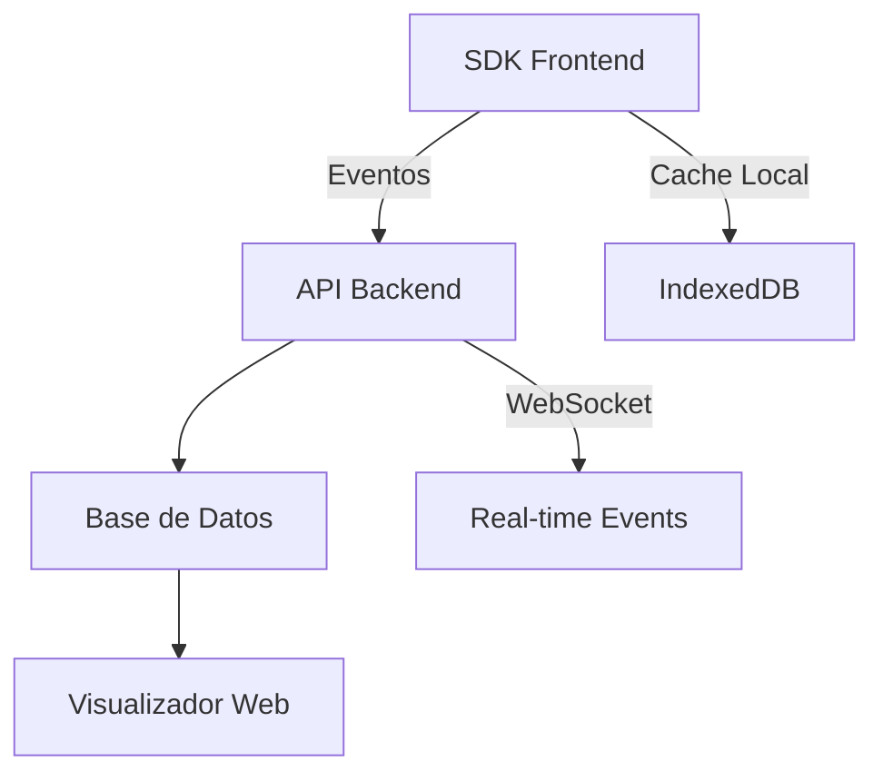

# 🎯 SpectraView - CIT Shadow Browser
## Sistema de Reproducción de Sesiones de Usuario

---

## 📋 Resumen Ejecutivo

**SpectraView** es una herramienta de session replay que permite a CIT reproducir visualmente las sesiones de usuarios en sus aplicaciones (Yalo Cobro, Bip Bip, PatMed, Emsula) sin necesidad de compartir pantalla. El sistema captura acciones del usuario y permite reproducirlas como una grabación interactiva.

**Tiempo de desarrollo:** 3 semanas  
**Presupuesto:** LPS. 9,500  
**Equipo:** 1 desarrollador full-stack  

---

## 🏗️ Arquitectura del Sistema



---

## 🛠️ Stack Tecnológico Completo

### **Frontend SDK**
```javascript
// Librerías principales
- rrweb: ^2.0.0          // Motor de grabación/reproducción
- pako: ^2.1.0           // Compresión de datos
- uuid: ^9.0.0           // Generación de IDs únicos
- localforage: ^1.10.0   // Wrapper para IndexedDB
```

### **Backend API**
```javascript
// Stack Node.js
- fastify: ^4.0.0        // Framework web rápido
- postgres: ^3.0.0       // Cliente PostgreSQL
- redis: ^4.0.0          // Cache y TTL
- socket.io: ^4.0.0      // WebSockets
- zod: ^3.0.0            // Validación de esquemas
```

### **Visualizador**
```javascript
// Stack React
- react: ^18.0.0
- rrweb-player: ^2.0.0   // Player de rrweb
- tailwindcss: ^3.0.0
- @radix-ui/react-*      // Componentes UI
- recharts: ^2.0.0       // Gráficos y analytics
```

---

## 📦 Componente 1: SDK de Captura Frontend

### **Estructura del SDK**

```typescript
// spectraview-sdk.ts
interface CaptureConfig {
  apiEndpoint: string;
  appId: string;
  userId?: string;
  sessionId?: string;
  captureMode: 'full' | 'privacy' | 'minimal';
  batchSize: number;
  flushInterval: number;
}

class SpectraViewSDK {
  private recorder: any;
  private events: any[] = [];
  private config: CaptureConfig;
  
  constructor(config: CaptureConfig) {
    this.config = config;
    this.initializeRecorder();
  }
  
  // Métodos principales
  startRecording(): void
  stopRecording(): void
  pauseRecording(): void
  flushEvents(): Promise<void>
  captureCustomEvent(event: CustomEvent): void
}
```

### **Eventos a Capturar**

```typescript
// Tipos de eventos
enum EventType {
  // Eventos DOM
  CLICK = 'click',
  INPUT = 'input',
  SCROLL = 'scroll',
  RESIZE = 'resize',
  
  // Navegación
  ROUTE_CHANGE = 'route_change',
  PAGE_LOAD = 'page_load',
  
  // Errores
  JS_ERROR = 'js_error',
  API_ERROR = 'api_error',
  
  // Custom
  CUSTOM_ACTION = 'custom_action'
}

// Estructura de evento
interface CaptureEvent {
  id: string;
  type: EventType;
  timestamp: number;
  sessionId: string;
  data: {
    selector?: string;
    value?: any;
    error?: string;
    metadata?: Record<string, any>;
  };
  context: {
    url: string;
    userAgent: string;
    viewport: { width: number; height: number };
  };
}
```

### **Implementación con rrweb**

```javascript
import * as rrweb from 'rrweb';
import { pack } from 'rrweb/typings/packer';

// Inicialización básica
const initRecorder = () => {
  let events = [];
  
  rrweb.record({
    emit(event) {
      // Comprimir evento
      const packed = pack(event);
      events.push(packed);
      
      // Enviar en batch cada 10 eventos o 5 segundos
      if (events.length >= 10) {
        sendBatch(events);
        events = [];
      }
    },
    
    // Configuración de privacidad
    maskAllInputs: true,
    maskInputOptions: {
      password: true,
      email: true,
      tel: true
    },
    
    // Opciones de captura
    blockClass: 'spectra-block',
    ignoreClass: 'spectra-ignore',
    
    // Sampling para reducir carga
    sampling: {
      scroll: 150,      // ms
      media: 800,       // ms
      input: 'last'     // solo último valor
    },
    
    // Plugins adicionales
    plugins: [
      // Plugin para capturar console.log
      rrweb.getRecordConsolePlugin(),
      
      // Plugin para capturar performance
      {
        name: 'performance',
        observer(cb) {
          const observer = new PerformanceObserver((list) => {
            cb(list.getEntries());
          });
          observer.observe({ entryTypes: ['measure', 'navigation'] });
        }
      }
    ]
  });
};
```

### **Almacenamiento Local con IndexedDB**

```javascript
import localforage from 'localforage';

// Configurar store local
const eventStore = localforage.createInstance({
  name: 'spectraview',
  storeName: 'events',
  driver: localforage.INDEXEDDB
});

// Guardar eventos localmente
const saveLocal = async (events) => {
  const timestamp = Date.now();
  await eventStore.setItem(`batch_${timestamp}`, {
    events,
    timestamp,
    synced: false
  });
  
  // Rotar eventos antiguos (mantener solo últimas 2 horas)
  await rotateOldEvents();
};

// Sincronizar con servidor
const syncWithServer = async () => {
  const keys = await eventStore.keys();
  
  for (const key of keys) {
    const batch = await eventStore.getItem(key);
    if (!batch.synced) {
      try {
        await sendToAPI(batch.events);
        batch.synced = true;
        await eventStore.setItem(key, batch);
      } catch (error) {
        console.error('Sync failed:', error);
      }
    }
  }
};
```

---

## 🔧 Componente 2: API Backend

### **Estructura de la API**

```typescript
// server.ts
import Fastify from 'fastify';
import postgres from 'postgres';
import Redis from 'redis';

const app = Fastify({ logger: true });
const sql = postgres(DATABASE_URL);
const redis = Redis.createClient();

// Endpoints principales
app.post('/sessions/start', startSession);
app.post('/sessions/:id/events', receiveEvents);
app.get('/sessions/:id', getSession);
app.get('/sessions/:id/replay', getReplayData);
app.delete('/sessions/expired', cleanupExpired);

// WebSocket para eventos en tiempo real
app.register(require('@fastify/websocket'));
app.get('/sessions/:id/live', { websocket: true }, liveSession);
```

### **Esquema de Base de Datos**

```sql
-- PostgreSQL Schema
CREATE EXTENSION IF NOT EXISTS "uuid-ossp";

-- Tabla de sesiones
CREATE TABLE sessions (
  id UUID PRIMARY KEY DEFAULT uuid_generate_v4(),
  app_id VARCHAR(50) NOT NULL,
  user_id VARCHAR(100),
  ticket_id VARCHAR(100),
  started_at TIMESTAMP DEFAULT NOW(),
  ended_at TIMESTAMP,
  metadata JSONB,
  ttl_hours INTEGER DEFAULT 72,
  INDEX idx_app_user (app_id, user_id),
  INDEX idx_ticket (ticket_id)
);

-- Tabla de eventos
CREATE TABLE events (
  id UUID PRIMARY KEY DEFAULT uuid_generate_v4(),
  session_id UUID REFERENCES sessions(id) ON DELETE CASCADE,
  event_type VARCHAR(50),
  timestamp BIGINT,
  data JSONB,
  created_at TIMESTAMP DEFAULT NOW(),
  INDEX idx_session_time (session_id, timestamp)
);

-- Vista materializada para analytics
CREATE MATERIALIZED VIEW session_analytics AS
SELECT 
  s.app_id,
  DATE(s.started_at) as date,
  COUNT(DISTINCT s.id) as total_sessions,
  COUNT(DISTINCT s.user_id) as unique_users,
  AVG(EXTRACT(EPOCH FROM (s.ended_at - s.started_at))) as avg_duration,
  COUNT(e.id) FILTER (WHERE e.event_type = 'error') as error_count
FROM sessions s
LEFT JOIN events e ON s.id = e.session_id
GROUP BY s.app_id, DATE(s.started_at);
```

### **Procesamiento de Eventos**

```javascript
// Event processor
const processEvents = async (sessionId, rawEvents) => {
  const events = [];
  
  for (const rawEvent of rawEvents) {
    // Descomprimir
    const event = unpack(rawEvent);
    
    // Sanitizar datos sensibles
    const sanitized = sanitizeEvent(event);
    
    // Enriquecer con metadata
    const enriched = {
      ...sanitized,
      sessionId,
      serverTimestamp: Date.now(),
      processed: true
    };
    
    events.push(enriched);
  }
  
  // Guardar en batch
  await sql`
    INSERT INTO events ${sql(events)}
  `;
  
  // Cache en Redis para acceso rápido
  await redis.setex(
    `session:${sessionId}:events`,
    3600,
    JSON.stringify(events)
  );
  
  return events;
};

// Sanitización de datos
const sanitizeEvent = (event) => {
  const sanitized = { ...event };
  
  // Remover valores de inputs
  if (sanitized.type === 'input') {
    sanitized.data.value = '[REDACTED]';
  }
  
  // Ofuscar emails
  if (sanitized.data?.text) {
    sanitized.data.text = sanitized.data.text.replace(
      /[\w.-]+@[\w.-]+\.\w+/g,
      '[EMAIL]'
    );
  }
  
  // Remover números de tarjeta
  if (sanitized.data?.text) {
    sanitized.data.text = sanitized.data.text.replace(
      /\b\d{4}[\s-]?\d{4}[\s-]?\d{4}[\s-]?\d{4}\b/g,
      '[CARD]'
    );
  }
  
  return sanitized;
};
```

---

## 🎬 Componente 3: Visualizador de Sesiones

### **Arquitectura del Player**

```jsx
// SpectraViewer.jsx
import { Replayer } from 'rrweb-player';
import 'rrweb-player/dist/style.css';

const SpectraViewer = ({ sessionId }) => {
  const [events, setEvents] = useState([]);
  const [player, setPlayer] = useState(null);
  const [currentTime, setCurrentTime] = useState(0);
  const [annotations, setAnnotations] = useState([]);
  
  useEffect(() => {
    loadSession(sessionId);
  }, [sessionId]);
  
  const loadSession = async (id) => {
    const response = await fetch(`/api/sessions/${id}/replay`);
    const data = await response.json();
    
    // Descomprimir eventos
    const unpacked = data.events.map(e => unpack(e));
    setEvents(unpacked);
    
    // Inicializar player
    const replayer = new Replayer(unpacked, {
      root: document.getElementById('player-container'),
      skipInactive: false,
      showWarning: false,
      showDebug: false,
      blockClass: 'spectra-block',
      liveMode: false,
      
      // Configuración de velocidad
      speed: 1,
      
      // Plugins
      plugins: [
        // Plugin de anotaciones
        {
          handler(event, isSync, context) {
            if (event.type === 'custom') {
              addAnnotation(event);
            }
          }
        }
      ]
    });
    
    setPlayer(replayer);
  };
  
  return (
    <div className="flex h-screen">
      {/* Player principal */}
      <div className="flex-1 bg-gray-100 p-4">
        <div id="player-container" className="w-full h-full" />
      </div>
      
      {/* Panel lateral */}
      <div className="w-80 bg-white border-l">
        <EventTimeline events={events} player={player} />
        <AnnotationsPanel annotations={annotations} />
      </div>
      
      {/* Controles */}
      <PlayerControls player={player} />
    </div>
  );
};
```

### **Timeline Interactivo**

```jsx
// EventTimeline.jsx
const EventTimeline = ({ events, player }) => {
  const [filter, setFilter] = useState('all');
  const [search, setSearch] = useState('');
  
  const filteredEvents = useMemo(() => {
    return events.filter(event => {
      if (filter !== 'all' && event.type !== filter) return false;
      if (search && !JSON.stringify(event).includes(search)) return false;
      return true;
    });
  }, [events, filter, search]);
  
  const jumpToEvent = (event) => {
    player.pause();
    player.play(event.timestamp);
  };
  
  return (
    <div className="p-4">
      <h3 className="font-bold mb-2">Timeline</h3>
      
      {/* Filtros */}
      <div className="flex gap-2 mb-4">
        <select 
          value={filter} 
          onChange={(e) => setFilter(e.target.value)}
          className="border rounded px-2 py-1"
        >
          <option value="all">Todos</option>
          <option value="click">Clicks</option>
          <option value="input">Inputs</option>
          <option value="error">Errores</option>
          <option value="navigation">Navegación</option>
        </select>
        
        <input
          type="text"
          placeholder="Buscar..."
          value={search}
          onChange={(e) => setSearch(e.target.value)}
          className="border rounded px-2 py-1 flex-1"
        />
      </div>
      
      {/* Lista de eventos */}
      <div className="space-y-2 max-h-96 overflow-y-auto">
        {filteredEvents.map((event, index) => (
          <EventCard 
            key={index}
            event={event}
            onClick={() => jumpToEvent(event)}
          />
        ))}
      </div>
    </div>
  );
};

// EventCard.jsx
const EventCard = ({ event, onClick }) => {
  const getIcon = () => {
    switch (event.type) {
      case 'click': return '👆';
      case 'input': return '⌨️';
      case 'error': return '❌';
      case 'navigation': return '🧭';
      default: return '📍';
    }
  };
  
  return (
    <div 
      onClick={onClick}
      className="p-2 border rounded hover:bg-gray-50 cursor-pointer"
    >
      <div className="flex items-center gap-2">
        <span>{getIcon()}</span>
        <div className="flex-1">
          <div className="font-medium text-sm">{event.type}</div>
          <div className="text-xs text-gray-500">
            {new Date(event.timestamp).toLocaleTimeString()}
          </div>
        </div>
      </div>
      {event.data?.selector && (
        <div className="text-xs text-gray-400 mt-1">
          {event.data.selector}
        </div>
      )}
    </div>
  );
};
```

### **Controles del Player**

```jsx
// PlayerControls.jsx
const PlayerControls = ({ player }) => {
  const [isPlaying, setIsPlaying] = useState(false);
  const [speed, setSpeed] = useState(1);
  const [progress, setProgress] = useState(0);
  
  useEffect(() => {
    if (!player) return;
    
    const timer = setInterval(() => {
      const meta = player.getMetaData();
      const current = player.getCurrentTime();
      setProgress((current / meta.totalTime) * 100);
    }, 100);
    
    return () => clearInterval(timer);
  }, [player]);
  
  const togglePlay = () => {
    if (isPlaying) {
      player.pause();
    } else {
      player.play();
    }
    setIsPlaying(!isPlaying);
  };
  
  const changeSpeed = (newSpeed) => {
    player.setSpeed(newSpeed);
    setSpeed(newSpeed);
  };
  
  const seek = (percentage) => {
    const meta = player.getMetaData();
    const time = (percentage / 100) * meta.totalTime;
    player.play(time);
  };
  
  return (
    <div className="fixed bottom-0 left-0 right-0 bg-white border-t p-4">
      <div className="max-w-4xl mx-auto">
        {/* Progress bar */}
        <div className="mb-4">
          <input
            type="range"
            min="0"
            max="100"
            value={progress}
            onChange={(e) => seek(e.target.value)}
            className="w-full"
          />
        </div>
        
        {/* Controles */}
        <div className="flex items-center justify-center gap-4">
          <button onClick={() => player.play(0)}>⏮️</button>
          <button onClick={togglePlay}>
            {isPlaying ? '⏸️' : '▶️'}
          </button>
          <button onClick={() => player.play()}>⏭️</button>
          
          <select 
            value={speed} 
            onChange={(e) => changeSpeed(Number(e.target.value))}
            className="border rounded px-2 py-1"
          >
            <option value={0.5}>0.5x</option>
            <option value={1}>1x</option>
            <option value={2}>2x</option>
            <option value={4}>4x</option>
          </select>
          
          <button onClick={() => player.toggleFullscreen()}>
            🔳 Fullscreen
          </button>
        </div>
      </div>
    </div>
  );
};
```

---

## 🔐 Seguridad y Privacidad

### **Técnicas de Anonimización**

```javascript
// privacy-manager.js
class PrivacyManager {
  constructor(config = {}) {
    this.rules = {
      // Selectores CSS a ignorar completamente
      blockSelectors: config.blockSelectors || [
        'input[type="password"]',
        '[data-sensitive="true"]',
        '.credit-card-input',
        '.ssn-input'
      ],
      
      // Patrones regex para sanitizar texto
      textPatterns: [
        { pattern: /\b\d{3}-\d{2}-\d{4}\b/g, replacement: '[SSN]' },
        { pattern: /\b\d{16}\b/g, replacement: '[CARD]' },
        { pattern: /[\w.-]+@[\w.-]+\.\w+/g, replacement: '[EMAIL]' },
        { pattern: /\b\d{3}[-.]?\d{3}[-.]?\d{4}\b/g, replacement: '[PHONE]' }
      ],
      
      // Clases CSS para ofuscar
      maskClasses: config.maskClasses || [
        'user-name',
        'user-email',
        'private-data'
      ]
    };
  }
  
  sanitizeEvent(event) {
    // Aplicar reglas de privacidad
    if (event.type === 'input') {
      event.data.value = this.maskValue(event.data.value);
    }
    
    if (event.data?.text) {
      event.data.text = this.sanitizeText(event.data.text);
    }
    
    return event;
  }
  
  maskValue(value) {
    if (!value) return '';
    return '*'.repeat(value.length);
  }
  
  sanitizeText(text) {
    let sanitized = text;
    for (const rule of this.rules.textPatterns) {
      sanitized = sanitized.replace(rule.pattern, rule.replacement);
    }
    return sanitized;
  }
}
```

### **Encriptación de Datos**

```javascript
// encryption.js
import crypto from 'crypto';

class DataEncryption {
  constructor(secretKey) {
    this.algorithm = 'aes-256-gcm';
    this.secretKey = crypto.scryptSync(secretKey, 'salt', 32);
  }
  
  encrypt(data) {
    const iv = crypto.randomBytes(16);
    const cipher = crypto.createCipheriv(this.algorithm, this.secretKey, iv);
    
    const encrypted = Buffer.concat([
      cipher.update(JSON.stringify(data), 'utf8'),
      cipher.final()
    ]);
    
    const authTag = cipher.getAuthTag();
    
    return {
      encrypted: encrypted.toString('base64'),
      iv: iv.toString('base64'),
      authTag: authTag.toString('base64')
    };
  }
  
  decrypt(encryptedData) {
    const decipher = crypto.createDecipheriv(
      this.algorithm,
      this.secretKey,
      Buffer.from(encryptedData.iv, 'base64')
    );
    
    decipher.setAuthTag(Buffer.from(encryptedData.authTag, 'base64'));
    
    const decrypted = Buffer.concat([
      decipher.update(Buffer.from(encryptedData.encrypted, 'base64')),
      decipher.final()
    ]);
    
    return JSON.parse(decrypted.toString('utf8'));
  }
}
```

---

## 📊 Analytics y Métricas

### **Dashboard de Análisis**

```jsx
// AnalyticsDashboard.jsx
import { BarChart, LineChart, PieChart } from 'recharts';

const AnalyticsDashboard = ({ appId }) => {
  const [metrics, setMetrics] = useState(null);
  
  useEffect(() => {
    loadMetrics(appId);
  }, [appId]);
  
  const loadMetrics = async (id) => {
    const response = await fetch(`/api/analytics/${id}`);
    const data = await response.json();
    setMetrics(data);
  };
  
  return (
    <div className="grid grid-cols-2 gap-4 p-6">
      {/* Sesiones por día */}
      <div className="bg-white p-4 rounded shadow">
        <h3 className="font-bold mb-4">Sesiones por Día</h3>
        <LineChart width={400} height={200} data={metrics?.sessionsPerDay}>
          <Line type="monotone" dataKey="count" stroke="#8884d8" />
          <XAxis dataKey="date" />
          <YAxis />
          <Tooltip />
        </LineChart>
      </div>
      
      {/* Errores más comunes */}
      <div className="bg-white p-4 rounded shadow">
        <h3 className="font-bold mb-4">Top Errores</h3>
        <BarChart width={400} height={200} data={metrics?.topErrors}>
          <Bar dataKey="count" fill="#ff4444" />
          <XAxis dataKey="error" />
          <YAxis />
          <Tooltip />
        </BarChart>
      </div>
      
      {/* Heatmap de clicks */}
      <div className="bg-white p-4 rounded shadow col-span-2">
        <h3 className="font-bold mb-4">Mapa de Calor - Clicks</h3>
        <HeatmapComponent data={metrics?.clickHeatmap} />
      </div>
      
      {/* Métricas clave */}
      <div className="bg-white p-4 rounded shadow col-span-2">
        <div className="grid grid-cols-4 gap-4">
          <MetricCard 
            title="Sesiones Totales" 
            value={metrics?.totalSessions} 
            icon="📊"
          />
          <MetricCard 
            title="Usuarios Únicos" 
            value={metrics?.uniqueUsers} 
            icon="👥"
          />
          <MetricCard 
            title="Duración Promedio" 
            value={`${metrics?.avgDuration}m`} 
            icon="⏱️"
          />
          <MetricCard 
            title="Tasa de Error" 
            value={`${metrics?.errorRate}%`} 
            icon="⚠️"
          />
        </div>
      </div>
    </div>
  );
};
```

### **Detección de Patrones Problemáticos**

```javascript
// pattern-detector.js
class PatternDetector {
  detectRageClicks(events) {
    const clicks = events.filter(e => e.type === 'click');
    const rageClicks = [];
    
    for (let i = 0; i < clicks.length - 2; i++) {
      const timeWindow = 2000; // 2 segundos
      const subsequentClicks = clicks.slice(i, i + 3);
      
      const timeDiff = subsequentClicks[2].timestamp - subsequentClicks[0].timestamp;
      
      if (timeDiff < timeWindow) {
        // Verificar si son en el mismo elemento
        const selectors = subsequentClicks.map(c => c.data.selector);
        if (selectors.every(s => s === selectors[0])) {
          rageClicks.push({
            timestamp: subsequentClicks[0].timestamp,
            selector: selectors[0],
            count: 3
          });
        }
      }
    }
    
    return rageClicks;
  }
  
  detectDeadClicks(events) {
    const clicks = events.filter(e => e.type === 'click');
    const deadClicks = [];
    
    clicks.forEach((click, index) => {
      // Buscar si hay algún cambio después del click
      const nextEvents = events.slice(index + 1, index + 5);
      const hasEffect = nextEvents.some(e => 
        e.type === 'navigation' || 
        e.type === 'dom_change' ||
        e.type === 'api_call'
      );
      
      if (!hasEffect) {
        deadClicks.push(click);
      }
    });
    
    return deadClicks;
  }
  
  detectErrorLoops(events) {
    const errors = events.filter(e => e.type === 'error');
    const loops = [];
    
    // Agrupar errores por mensaje
    const errorGroups = {};
    errors.forEach(error => {
      const key = error.data.message;
      if (!errorGroups[key]) {
        errorGroups[key] = [];
      }
      errorGroups[key].push(error);
    });
    
    // Detectar si algún error se repite más de 3 veces
    Object.entries(errorGroups).forEach(([message, errors]) => {
      if (errors.length >= 3) {
        loops.push({
          message,
          count: errors.length,
          firstOccurrence: errors[0].timestamp,
          lastOccurrence: errors[errors.length - 1].timestamp
        });
      }
    });
    
    return loops;
  }
}
```

---

## 🚀 Plan de Implementación (3 Semanas)

### **Semana 1: Fundación**
- **Días 1-2:** Setup del proyecto, configuración de entornos
- **Días 3-4:** SDK básico con rrweb
- **Día 5:** API backend básica
- **Fin de semana:** Testing de integración inicial

### **Semana 2: Desarrollo Core**
- **Días 1-2:** Sistema de almacenamiento y base de datos
- **Días 3-4:** Visualizador básico
- **Día 5:** Sistema de seguridad y privacidad
- **Fin de semana:** Optimizaciones y refactoring

### **Semana 3: Pulido y Deploy**
- **Días 1-2:** Analytics y detección de patrones
- **Día 3:** Integración con Yalo POS
- **Día 4:** Testing exhaustivo
- **Día 5:** Documentación y deploy
- **Fin de semana:** Buffer para ajustes finales

---

## 📚 Recursos y Referencias

### **Librerías Principales**
- [rrweb](https://github.com/rrweb-io/rrweb) - Motor de grabación/reproducción
- [rrweb-player](https://github.com/rrweb-io/rrweb/tree/master/packages/rrweb-player) - Player UI
- [LogRocket](https://logrocket.com/) - Inspiración de features
- [FullStory](https://www.fullstory.com/) - Referencia de UX
- [Hotjar](https://www.hotjar.com/) - Referencia de heatmaps

### **Documentación Técnica**
- [MutationObserver API](https://developer.mozilla.org/en-US/docs/Web/API/MutationObserver)
- [IndexedDB API](https://developer.mozilla.org/en-US/docs/Web/API/IndexedDB_API)
- [Performance Observer API](https://developer.mozilla.org/en-US/docs/Web/API/PerformanceObserver)
- [Intersection Observer API](https://developer.mozilla.org/en-US/docs/Web/API/Intersection_Observer_API)

### **Herramientas de Desarrollo**
```json
{
  "devDependencies": {
    "vite": "^4.0.0",
    "typescript": "^5.0.0",
    "eslint": "^8.0.0",
    "prettier": "^3.0.0",
    "jest": "^29.0.0",
    "playwright": "^1.40.0"
  }
}
```

---

## 🎯 Entregables Finales

### **MVP Funcional**
- [ ] SDK embebible funcionando en React
- [ ] API con endpoints básicos
- [ ] Visualizador con controles básicos
- [ ] Sistema de privacidad implementado
- [ ] Integración con una app de prueba

### **Documentación**
- [ ] README con instrucciones de instalación
- [ ] Guía de integración para desarrolladores
- [ ] API documentation (OpenAPI/Swagger)
- [ ] Ejemplos de código

### **Testing**
- [ ] Tests unitarios (>70% coverage)
- [ ] Tests de integración
- [ ] Tests E2E con Playwright
- [ ] Pruebas de carga básicas

### **Deploy**
- [ ] Docker containers
- [ ] CI/CD pipeline
- [ ] Scripts de deploy
- [ ] Configuración de monitoreo

---

## 💡 Mejoras Futuras

### **Fase 2**
- Soporte para aplicaciones móviles (React Native)
- Integración con Slack/Teams
- Exportación de sesiones como video MP4
- Machine Learning para detectar patrones

### **Fase 3**
- Collaborative replay (múltiples usuarios viendo la misma sesión)
- A/B testing integration
- Custom dashboards
- API pública para integraciones externas

---

## 📝 Notas de Implementación

### **Optimizaciones de Performance**
```javascript
// Técnicas para reducir impacto en performance
1. Throttling de eventos (scroll, resize)
2. Compresión con pako/lz-string
3. Lazy loading de chunks
4. Web Workers para procesamiento pesado
5. Virtual scrolling en listas largas
```

### **Consideraciones de Escalabilidad**
```javascript
// Estrategias para manejar alto volumen
1. Particionamiento de tablas por fecha
2. CDN para assets estáticos
3. Queue system (Bull/RabbitMQ) para procesamiento async
4. Microservicios para componentes críticos
5. Horizontal scaling con Kubernetes
```

---

## 🤝 Contacto y Soporte

**Desarrollador:** [Tu nombre]  
**Email:** [tu.email@cit.com]  
**Slack:** #cit-lab-spectraview  
**Repo:** github.com/cit-lab/spectraview  

---

*Última actualización: [Fecha]*  
*Versión del documento: 1.0.0*